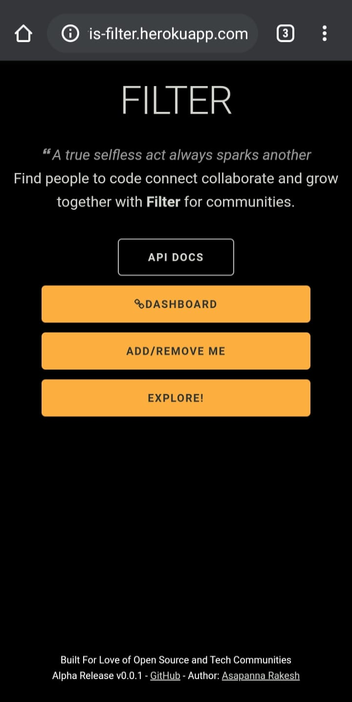
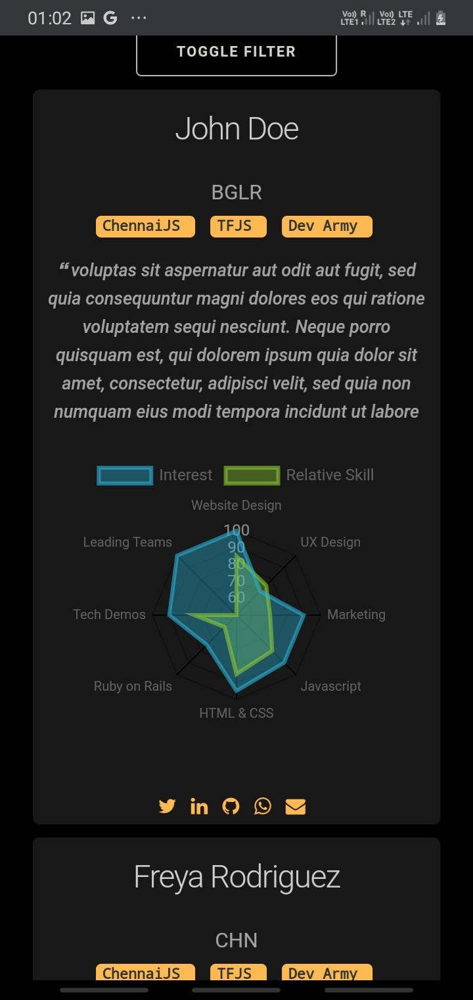
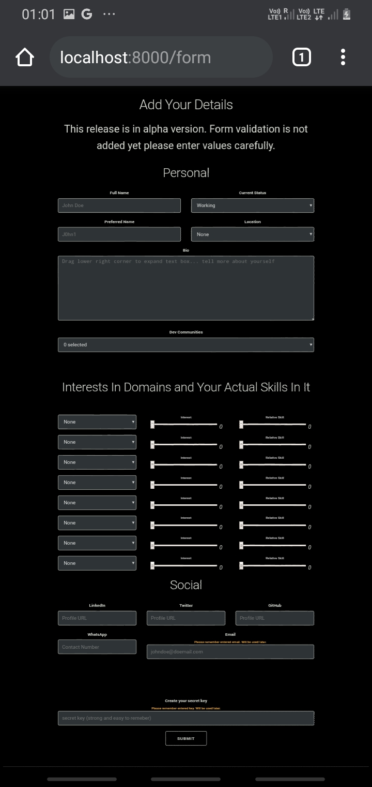
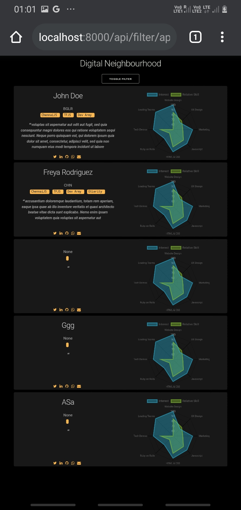
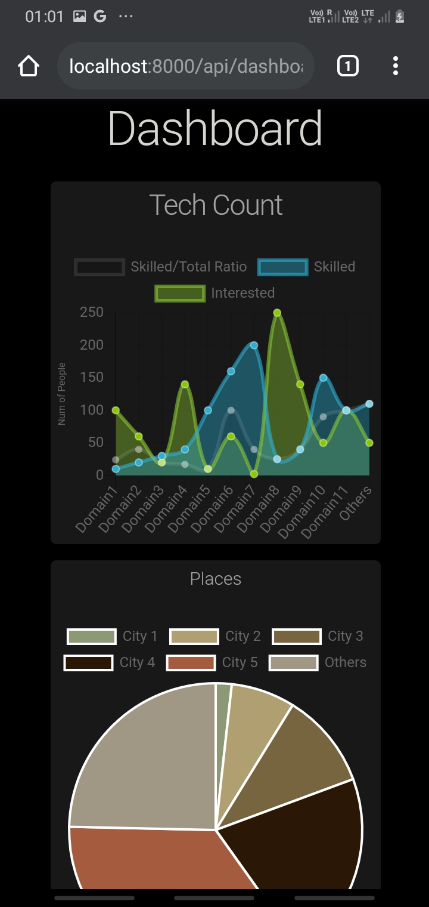
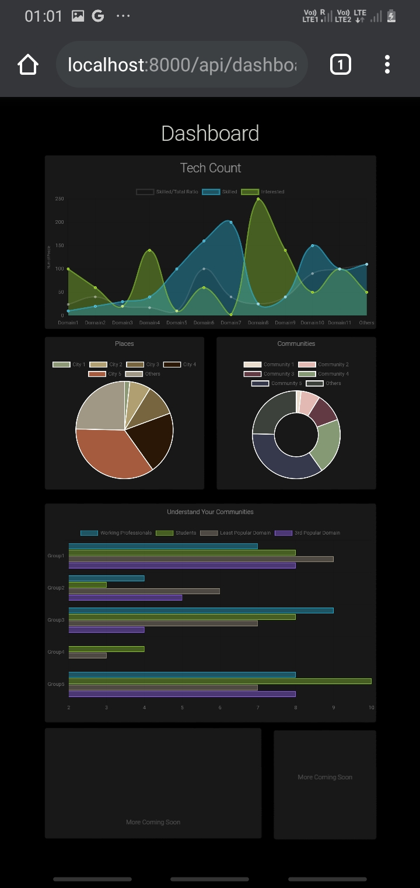

```
 ________ ___  ___   _________  _______   ________     
|\  _____\\  \|\  \ |\___   ___\\  ___ \ |\   __  \    
\ \  \__/\ \  \ \  \\|___ \  \_\ \   __/|\ \  \|\  \   
 \ \   __\\ \  \ \  \    \ \  \ \ \  \_|/_\ \   _  _\  
  \ \  \_| \ \  \ \  \____\ \  \ \ \  \_|\ \ \  \\  \| 
   \ \__\   \ \__\ \_______\ \__\ \ \_______\ \__\\ _\ 
    \|__|    \|__|\|_______|\|__|  \|_______|\|__|\|__|
                                                       
             What you seek is already seeking you!                             
                                                       
```

**Filter for communities** is an open-source application/API that let's you connect with
people whom you are looking for. It summarizes people into concise cards that you
can filter. Apart from Dashboard visualisation, API can be used for various tasks like community management or sending mass connection requests. Recommendation System coming soon! 

## Screenshots

|  |  |  |
| --- | --- | --- |
|  |  |  | 
|  |  |  | 


## How to use

- Python 3.7 or above needed
- Clone the `master` branch
- Install dependencies using `pip3` from `requirements.txt`
- Go to main directory and run using command `python3 -m uvicorn main:app`

[**>>> Hosted here with Herok❤️u**](https://vis-filter.herokuapp.com/)


## How to contribue

Please feel free to contact the author or existing contributors. 
Project is so much in development.

- [See existing issues you can solve](https://github.com/rakesh4real/FILTER/issues/7)
- Conatct [main author](https://rakesh4real.github.io/) or [existing contributors](github/contributors.txt)

## License

**Filter** is distributed under the [Academic Public License](LICENSE.txt).

